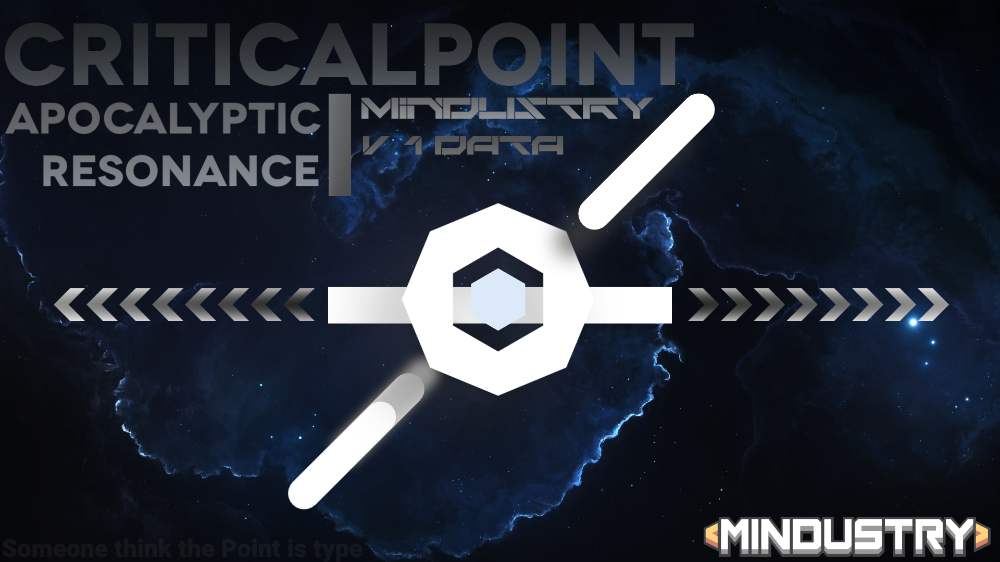

# 临界点CriticalPoint || 终焉绝响Apocalyptic Resonance

## ‖CriticalPoint
**Author: Yuki , ALL Mods Maker**

## ‖ApocalypticResonance
**Author: Yuki ，77 ，1om6**

## Why I havent updata so long? ‖‖ 为什么我这么长时间没有更新？
**Answer ‖‖ 回答**
## EN
  [Because the previous mod had issues with texture quality, code, and personal life]
  
## CN
   [因为我之前的模组 (临界点) 有着许多未完工的项目以及计划，还有许多大饼没有做，所以对于玩家而言是一个致命的问题]
   [还有就是模组的质量，我个人认为我的模组质量还是不足的] 
   [其次是我的生活问题，本人马上中考时间往往较少，只是对代码有所探讨，贴图就算了吧。(所以我要贴图师awa)]
   
   
## Why do I created this mod? ‖‖ 我为什么要创建这一个模组？
**终焉绝响Apocalyptic Resonance**
#### EN
   [Actually, I created this for the convenience of distinguishing between new and old]
   
#### CN
   [说白了，就是方便区别新版旧版。]
   [还可以不沿接临界点的模组背景🤓🤓]
   
   
## Sorry About ‖‖ 道歉

#### 我深刻的对广大支持临界点模组的玩家给予由衷的道歉，不仅仅是对自己过往不负责的道歉，也是对玩家的道歉，相信在未来的 [临界点CriticalPoint || 终焉绝响Apocalyptic Resonance](简称CRAR)我会对大家带来更好的模组，更好的游玩体验！
      
## From created   2025-2-9 UTC+8-00:30
#### We cannot be certain that JS can run on iOS
#### 我们不能确定像素工厂的jsAPI可以完全无漏洞的在ios上运行
**如果游戏中的内容过于少的话，那就换个安卓手机**